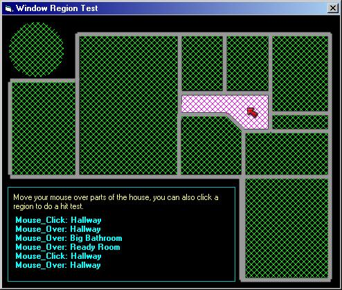

<div align="center">

## Windows Regions \(the easy way\)


</div>

### Description

Create windows regions and detect mouse states over those regions - this is the base foundation for image maps and "hot images". if you like this then VOTE. Seems like I always make it into the contest but get beaten by "mac style buttons" - not complaining, just wishing.
 
### More Info
 
Good understanding of the windows API would help

none known


<span>             |<span>
---                |---
**Submitted On**   |2002-02-17 00:21:02
**By**             |[Bryan A\. Cairns](https://github.com/Planet-Source-Code/PSCIndex/blob/master/ByAuthor/bryan-a-cairns.md)
**Level**          |Beginner
**User Rating**    |4.7 (71 globes from 15 users)
**Compatibility**  |VB 5\.0, VB 6\.0
**Category**       |[Complete Applications](https://github.com/Planet-Source-Code/PSCIndex/blob/master/ByCategory/complete-applications__1-27.md)
**World**          |[Visual Basic](https://github.com/Planet-Source-Code/PSCIndex/blob/master/ByWorld/visual-basic.md)
**Archive File**   |[Windows\_Re556782172002\.zip](https://github.com/Planet-Source-Code/bryan-a-cairns-windows-regions-the-easy-way__1-31865/archive/master.zip)

### API Declarations

```
CreatePolyPolygonRgn
CreatePolygonRgn
CreateBrushIndirect
CreateRectRgn
CreateRectRgnIndirect
CreateEllipticRgn
CreateEllipticRgnIndirect
FillRgn
FrameRgn
GetObject
SelectObject
DeleteObject
InvertRgn
```


